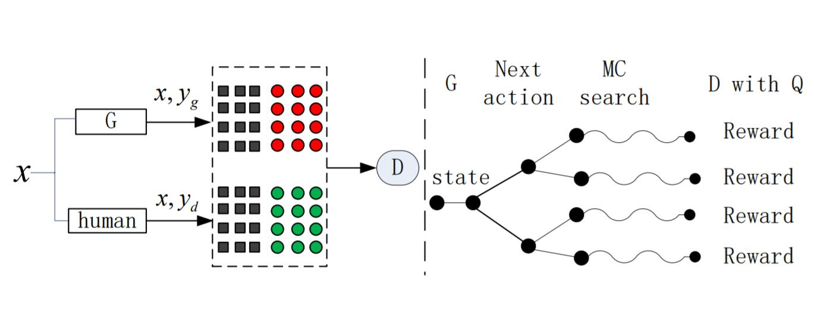

## Improving Neural Question Generation with CGAN

This repository contains code about Improving NQG with CGAN, which adds a discriminator to do adversarial training to improve the performance of neural question generation network.

(image from the reference below)

## About the Code

Environment: Pytorch 4.0, Python 3.6 

Package Requirement: torchtext, nltk, numpy

Run on GPU: Python train.py

## Performance

Pre-trained MLE Model: BLEU-4: 8.3

Model after adversarial training: BLEU-4: 8.5

Although the BLEU-4 metric is not very high in the experiment, this code provides a basic framework which might be useful.

## Reference
- [Improving Neural Machine Translation with Conditional Sequence Generative Adversarial Nets](https://arxiv.org/pdf/1703.04887.pdf)

